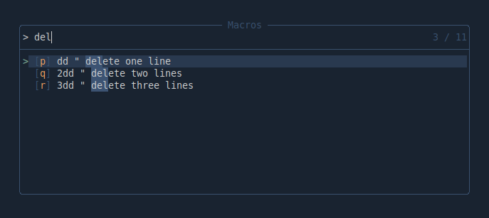

# telescope-macros.nvim

[](https://github.com/1riz/telescope-macros.nvim/actions/workflows/main.yml)

An extension for [telescope.nvim](https://github.com/nvim-telescope/telescope.nvim)
that allows you to manage your macros.



:warning: **This plugins is under development.**

## Requirements

- [telescope.nvim](https://github.com/nvim-telescope/telescope.nvim)

## Installation

### [Lazy.nvim](https://github.com/folke/lazy.nvim)

```lua
{
  "1riz/telescope-macros.nvim",
  config = function()
    require("telescope").load_extension "macros"
  end
}
```

## Usage

```vim
:Telescope macros
```

or map to a key:

```lua
vim.keymap.set("n", "<space>m", "<cmd>Telescope macros<cr>")
```

## Default mappings (normal and insert mode):

| Key     | Description                         |
| ------- | ----------------------------------- |
| `<cr>`  | execute macro                       |
| `<c-e>` | edit macro                          |
| `<c-t>` | append comment                      |
| `<c-k>` | clear macro                         |
| `<c-a>` | clear all macros                    |
| `<c-d>` | delete macro                        |
| `<c-r>` | delete all macros                   |

## Configuration

See [setup structure](https://github.com/nvim-telescope/telescope.nvim#telescope-setup-structure) for full details on configuring Telescope pickers.

- `prompt_title` (default: `"Macros"`)

  Defines the title of the prompt window.

- `num_registers` (default: `12`)

  Number of registers to be managed by this extension.

### Default configuration

```lua
telescope.setup {
  extensions = {
    macros = {
      prompt_title = "Macros",
      num_registers = 12,
      theme = "dropdown",
      layout_strategy = "center",
      layout_config = {
        height = 0.20,
        width = 0.50
      }
    }
  }
}
```
